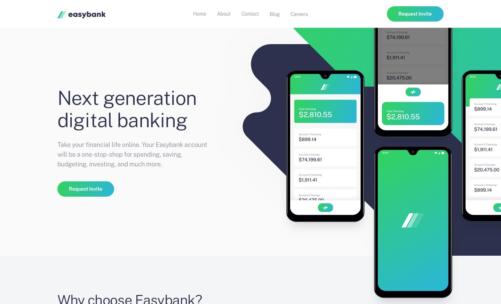

# Frontend Mentor - Easybank landing page solution


This is a solution to the [Easybank landing page challenge on Frontend Mentor](https://www.frontendmentor.io/challenges/easybank-landing-page-WaUhkoDN). Frontend Mentor challenges help you improve your coding skills by building realistic projects.

- Solution URL: [Github Repository](https://github.com/eLAmaravati/easybank-nextjs)
- Live Site URL: [Live site URL](https://easybank-nextjs-ochre.vercel.app/)

## Table of contents

- [Overview](#overview)
  - [The challenge](#the-challenge)
- [My process](#my-process)
  - [Built with](#built-with)
  - [Issue & Approach](#issue--approach)
  - [What I learned](#what-i-learned)
  - [Continued development](#continued-development)
  - [Useful resources](#useful-resources)
- [Author](#author)
- [Acknowledgments](#acknowledgments)


## Overview

### The challenge

Users should be able to:

- View the optimal layout for the site depending on their device's screen size
- See hover states for all interactive elements on the page

## My process

Sebetulnya, tantangan dari Frontend Mentor adalah membuat *landing page* menggunakan `HTML`, `CSS`, dan `JavaScript`. Tetapi, karena saya sedang mengasah JavaScript *framework*, jadi saya *slicing* menggunakan `NextJS`. 

**Mulai:** 10 Desember 2022
**Selesai:** 11 Desember 2022

### Built with

- [Next.js](https://nextjs.org/) - React framework
- [React](https://reactjs.org/) - JS library
- Semantic HTML5 markup
- Bootstrap - for grid system
- Saas - For styles
- Flexbox

### Issue & Approach

Berikut ini beberapa kendala yang saya hadapi dan pendekatan yang saya lakukan.

#### 1. Header

**Kendala**

Tantangan terbesar adalah membuat *header* dengan `background-image` dan ada gambar yang *overlapping* di atasnya.

Ini gambar *background* yang diberikan:


Ini desain yang diharapkan:



**Pendekatan**

Karena saya kesulitan mengatur `top` dan `right` di `CSS` untuk `background-image`, saya memotong gambar sesuai dengan desain yang diharapkan jadi tidak perlu mengatur `negative value` untuk `top` dan `right`.

Pendekatan ini sekaligus menghilangkan kendala lain: `overflow`.

*Background image* yang sudah dipotong:


#### 2. ESLint

**Kendala**

Sempat terjadi eror saat di-*deploy* ke Vercel. Itu karena saya menggunakan tag HTML `<image>` alih-alih menggunakan komponen `<Image />`. Alasan saya tidak menggunakan komponen karena tidak ingin menentukan `width` dan `height` di atribut.

**Pendekatan**

Semua *image* diganti menggunakan komponen `<Image />`. Untuk *images* yang ukurannya tidak sesuai atau terdistorsi, diperbaiki di `CSS`.

#### 3. CSS Modules/SCSS

**Kendala**

`NextJS` dilengkapi dengan *built-in* CSS Modules


### What I learned

Ini pertama kalinya saya menggunakan `NextJS` untuk `real project`. 

```css
.header {
  overflow: hidden;
  position: relative;
  background: $lightGray url('/bg-desktop.webp') no-repeat top 0 right 0;
  background-size: contain;
  height: 600px;
}
```

### Continued development

1. Masih kurang yakin dengan pendekatan yang saya lakukan saat mengatur SCSS. 
2. Page speed di Lighthouse dan GTMetrix angkanya sempurna.
  

### Useful resources

- [Playlist NextJS - Prawito Hudoro](https://www.youtube.com/playlist?list=PLU4DS8KR-LJ3-zouYHHknPq1G5VTB8PRf) - *Playlist* dari *channel* Pak Prawito ini membantu saya sebagai panduan dari mulai *setup project* sampai *deploy*.
- [Backgrounds and borders](https://developer.mozilla.org/en-US/docs/Learn/CSS/Building_blocks/Backgrounds_and_borders) - This is an amazing article which helped me finally understand XYZ. I'd recommend it to anyone still learning this concept.

## Author

- Website - [Langit Amaravati](https://www.langitamaravati.com)
- Frontend Mentor - [@elamaravati](https://www.frontendmentor.io/profile/elamaravati)
- Twitter - [@elamaravati](https://www.twitter.com/elamaravati)

## Acknowledgments

This is where you can give a hat tip to anyone who helped you out on this project. Perhaps you worked in a team or got some inspiration from someone else's solution. This is the perfect place to give them some credit.

